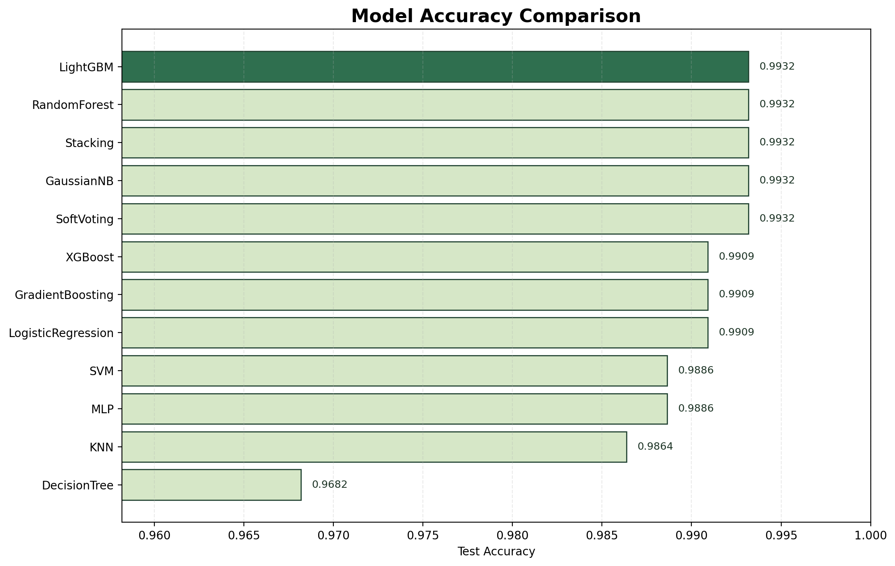

# Crop Prediction and Recommendation Using Soil and Weather Data

This repository contains a complete end-to-end machine learning research pipeline for recommending the most suitable crop based on soil nutrients and weather conditions.

The project was built around the included `data/Crop_recommendation.csv` dataset and follows a research-oriented workflow instead of a minimal tutorial pipeline. It includes:

- advanced preprocessing benchmarks
- exploratory data analysis and visualization
- statistical testing
- multiple classical machine learning models
- ensemble learning
- neural networks
- model comparison and significance testing
- interpretability using SHAP and LIME
- a Streamlit web app for interactive prediction

## Project Overview

The prediction task is a multi-class classification problem where the target is the crop label and the input features are:

- `N`
- `P`
- `K`
- `temperature`
- `humidity`
- `ph`
- `rainfall`

The pipeline trains and compares many candidate models, then selects the best-performing one based on validation and test metrics.

## Models Implemented

All model code is included in the repository, not only the best model.

Base models:

- Logistic Regression
- Decision Tree
- Random Forest
- K-Nearest Neighbors
- Gaussian Naive Bayes
- Support Vector Machine
- Gradient Boosting
- XGBoost
- LightGBM
- Multi-Layer Perceptron

Ensemble models:

- Soft Voting Classifier
- Stacking Classifier

The final trained best model on the current dataset was `SoftVoting`, but the full code for training and comparing every model is available in the repository.

## Research Workflow

The main workflow is orchestrated by:

- [run_research_pipeline.py](./run_research_pipeline.py)

This file calls the internal modules and performs the following steps:

1. Load and validate the dataset
2. Statistical dataset summary
3. Missing-value benchmarking using synthetic masking
4. Outlier detection using Z-score, IQR, and Mahalanobis distance
5. Correlation, covariance, VIF, and hypothesis testing
6. Feature engineering with agronomic derived features
7. Scaling benchmark
8. PCA and LDA dimensionality reduction comparison
9. EDA plot generation
10. Model tuning and cross-validation
11. Ensemble training
12. Significance testing across model scores
13. Interpretability outputs
14. Final report and saved deployment-ready model

## Repository Structure

```text
CropPrediction/
├── app.py
├── recommend_crop.py
├── run_research_pipeline.py
├── requirements.txt
├── README.md
├── docs/
│   └── assets/
├── artifacts/
│   └── research_run/
├── data/
├── src/
│   ├── crop_prediction/
│   └── crop_research/
│       ├── data.py
│       ├── preprocessing.py
│       ├── transformers.py
│       ├── visualization.py
│       ├── modeling.py
│       ├── interpretability.py
│       └── reporting.py
└── train_compare.py
```

## Main Files and Their Roles

### Core research pipeline

- [run_research_pipeline.py](./run_research_pipeline.py)
  Runs the full pipeline from raw CSV to saved reports, plots, tables, and best model.

- [src/crop_research/data.py](./src/crop_research/data.py)
  Loads the dataset, checks required columns, extracts features and targets, and builds dataset summaries.

- [src/crop_research/preprocessing.py](./src/crop_research/preprocessing.py)
  Handles imputation benchmarking, outlier analysis, correlation analysis, VIF, hypothesis testing, scaling comparison, and dimensionality reduction benchmarking.

- [src/crop_research/transformers.py](./src/crop_research/transformers.py)
  Creates domain-based engineered features such as `npk_sum`, nutrient balance, and rainfall-temperature ratio.

- [src/crop_research/visualization.py](./src/crop_research/visualization.py)
  Generates figures such as feature distributions, heatmaps, PCA plots, clustering visuals, and pair plots.

- [src/crop_research/modeling.py](./src/crop_research/modeling.py)
  Contains all model definitions, hyperparameter search spaces, cross-validation logic, ensemble learning, evaluation, significance testing, and best-model export.

- [src/crop_research/interpretability.py](./src/crop_research/interpretability.py)
  Generates permutation importance, SHAP importance plots, and LIME local explanations.

- [src/crop_research/reporting.py](./src/crop_research/reporting.py)
  Builds the markdown research report and JSON run summaries.

### App and inference

- [recommend_crop.py](./recommend_crop.py)
  Predicts the best crop from command-line input using the saved trained model.

- [app.py](./app.py)
  Streamlit web app with direct user input fields and a more website-style interface.

### Legacy/simple scaffold

- [train_compare.py](./train_compare.py)
- [src/crop_prediction](./src/crop_prediction)

These files belong to the earlier simplified prototype. The full research pipeline uses the `crop_research` package.

## Setup

Create and activate a virtual environment if you want:

```powershell
python -m venv .venv
.venv\Scripts\Activate.ps1
```

Install dependencies:

```powershell
pip install -r requirements.txt
```

## Running the Full Pipeline

Use the included dataset:

```powershell
python run_research_pipeline.py --data "data\Crop_recommendation.csv"
```

This command creates:

- `artifacts/research_run/figures/`
- `artifacts/research_run/tables/`
- `artifacts/research_run/reports/`
- `artifacts/research_run/dashboard/`
- `artifacts/research_run/interpretability/`
- `artifacts/research_run/best_model/`

## Predicting a Crop from Terminal

```powershell
python recommend_crop.py --model-path artifacts\research_run\best_model\best_pipeline.joblib --N 90 --P 42 --K 43 --temperature 21 --humidity 82 --ph 6.5 --rainfall 203
```

## Running the Streamlit Website

```powershell
streamlit run app.py
```

## Sample Outputs

### Model Accuracy Comparison



### Correlation Heatmap


### PCA Scatter Projection


### Confusion Matrix


### SHAP Global Importance


## Key Output Files

Important generated files include:

- `artifacts/research_run/tables/model_leaderboard.csv`
- `artifacts/research_run/tables/model_significance_tests.csv`
- `artifacts/research_run/reports/research_report.md`
- `artifacts/research_run/reports/run_summary.json`
- `artifacts/research_run/best_model/best_pipeline.joblib`
- `artifacts/research_run/best_model/best_model_metadata.json`
- `artifacts/research_run/dashboard/model_comparison.html`
- `artifacts/research_run/dashboard/roc_curves.html`
- `artifacts/research_run/dashboard/precision_recall_curves.html`

## Notes on Methodology

- The original dataset contains no missing values.
- To compare imputation techniques rigorously, synthetic missingness was introduced and reconstruction quality plus downstream classification performance were benchmarked.
- Since the dataset is balanced across crop classes, macro metrics are emphasized alongside accuracy.
- High performance on this dataset does not automatically guarantee the same performance on noisy real-world farm data, so external validation remains important.

## Current Best Model Result

On the current dataset, the best model selected by the research pipeline was:

- `SoftVoting`

With approximately:

- Accuracy: `0.9932`
- Macro-F1: `0.9932`
- Balanced Accuracy: `0.9932`
- Top-3 Accuracy: `1.0000`

## Future Improvements

- add external validation on region-specific or seasonal datasets
- build a richer web UI with crop-specific result visuals
- add downloadable PDF research report export
- connect the app to live weather APIs
- support crop yield prediction as a second task

## License / Dataset Note

This repository contains the project code, generated outputs, and the crop recommendation dataset used for the experiments. If you reuse this dataset publicly, please still verify the original source and redistribution terms.
